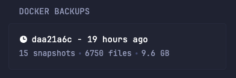

# Restic Glance Extension
_View the full repository [here](https://github.com/not-first/restic-glance-extension)_



A simple widget that shows information about the latest snapshot in a restic repo.
Displays the short ID of the latest snapshot, and the time it was created in a human readable form. Also includes general information about the repo.
Optionally, if [autorestic](https://autorestic.vercel.app/) is being used to back up it can show a small icon to indicate whether the backup was automatic or manual.

## Setup
### Docker Compose
Add the following to your existing glance docker compose
```yml
services:
  glance:
    image: glanceapp/glance
    # ...

  restic-glance-extension:
    image: ghcr.io/not-first/restic-glance-extension
    ports:
      - '8675:8675'
    volumes:
      - /my/backup/location/repo1:/app/repos/repo1
      - /my/backup/location/repo2-different-name:/app/repos/repo1
    restart: unless-stopped
    env_file: .env
```
#### Environment Variables
This widget must be set up be providing environment variables, which can be added to your existing glance .env file. A full environment file might look like this:
```env
RESTIC_REPOS=repo1,repo2
REPO1_RESTIC_PASSWORD=mypassword1
REPO2_RESTIC_PASSWORD=mypassword2

RESTIC_CACHE_INTERVAL=3600
```

The `REPOS` variable must contain comma seperated list of repo aliases, which are simple names you assign to allow the program to differentiate between repos. Note that:
  - Each repo must have a corresponding volume mount to the folder `app/repos/{alias}`. See the provided .env.example and docker-compose.yml file above for a simple example.
    Note that this alias does not have to correspond to the name of the repo folder on your machine. **Just where it is mounted to.**

Each repo alias must also have an environment variable called `{PREFIX}_RESTIC_PASSWORD`, where `{PREFIX}` is the capitalised alias of the repo.

`RESITC_CACHE_INTERVAL` can be set to a time in seconds, where the cache will be updated with the repo info every interval. _If not supplied it defaults to 3600 (1 hour)._
  - When the cache is updated, it fetches the restic repo stats and snapshot info. The humanised time difference is calculated for each request.

### Glance Config
Next, add the extension widget into your glance page by creating an environment variable storing the IP and port for the API, and adding this to your `glance.yml`.
```yml
- type: extension
  title: My Backups
  url: http://${RESTIC_EXTENSION_URL}/{repo-alias}
  cache: 1s # set to any time of your choice.
  allow-potentially-dangerous-html: true
```
The endpoint for your restic repo is accessible on the path `/{repo-alias}`, where `{repo-alias}` is the alias set for the repo in your .env file. In the example .env above, `/repo1` or `/repo2` would be used.

An optional icon can be shown to indicate the method of backup (manual or cron).
This is detected using the tags that [autorestic](https://autorestic.vercel.app/) applies to snapshots, therefore using autorestic to manage the repo is required.

To enable it, add the 'autorestic-icon' parameter with a value of 'true' to the extension widget:
```yml
parameters:
  autorestic-icon: true
```

---