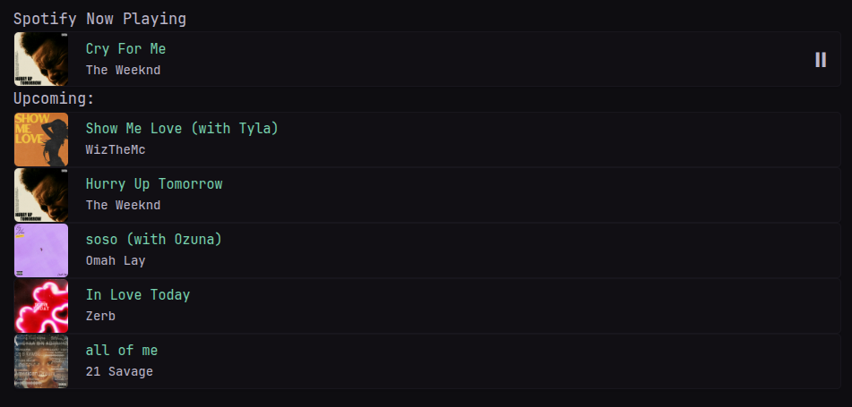

```yaml
- type: custom-api
  hide-header: true
  cache: 1s
  frameless: true
  template: |
    {{
      $tokenRes := newRequest "https://accounts.spotify.com/api/token"
        | withHeader "Authorization" "Basic ${SPOTIFY_BTOA}"
        | withHeader "Content-Type" "application/x-www-form-urlencoded"
        | withStringBody "grant_type=refresh_token&refresh_token=${SPOTIFY_REFRESH}"
        | getResponse
    }}

    {{ if eq $tokenRes.Response.StatusCode 200 }}
      {{ $accessToken := $tokenRes.JSON.String "access_token" }}

      {{ $currentlyPlaying := newRequest "https://api.spotify.com/v1/me/player" 
          | withHeader "Authorization" (print "Bearer " $accessToken)
          | getResponse          
      }}
      {{ $isCurrentlyPlaying := $currentlyPlaying.JSON.Bool "is_playing" }}
      {{ $isDeviceActive := $currentlyPlaying.JSON.Bool "device.is_active" }}
      {{ $isPrivateSession := $currentlyPlaying.JSON.Bool "device.is_private_session" }}
      {{ $queueRes := newRequest "https://api.spotify.com/v1/me/player/queue"
          | withHeader "Authorization" (print "Bearer " $accessToken)
          | getResponse
      }}

      {{ if eq $queueRes.Response.StatusCode 200 }}
        {{ $data := $queueRes.JSON }}
        {{ $queue := $data.Array "queue" }}

        {{ $artist := $data.String "currently_playing.artists.0.name" }}

        {{ if gt (len $artist) 0 }}
        <div class="size-h1">Spotify Now Playing</div>
        <div class="widget-content-frame flex flex-row items-center gap-20">
          <div>
            
          </div>
          <div class="flex grow flex-column justify-center pr-2">
            <div class="color-positive size-h3 font-bold">{{ $data.String "currently_playing.name" }}</div>
            <div class="size-h4">{{ $artist }}</div>
          </div>
          {{ if and $isDeviceActive (not $isPrivateSession) }}
            {{ if $isCurrentlyPlaying }}
            <button style="font-size:25px; margin-right:10px;" onclick="fetch('https://api.spotify.com/v1/me/player/pause',{method:'PUT',headers:{'Authorization':'Bearer {{$accessToken}}'}}); setTimeout(function(){ location.reload(); }, 2000);">⏸</button>
            {{ else }}
              <button style="font-size:25px; margin-right:10px;" onclick="fetch('https://api.spotify.com/v1/me/player/play',{method:'PUT',headers:{'Authorization':'Bearer {{$accessToken}}'}}); setTimeout(function(){ location.reload(); }, 2000);">▶</button>
            {{ end }} 
          {{ end }}
        </div>
        {{ end }}
  
        {{ if gt (len $queue) 0 }}
          <div class="size-h1 color-muted font-bold mb-1">Upcoming:</div>
          {{ range $i, $track := $queue }}
            {{ if lt $i 5 }}
              <div class="widget-content-frame flex flex-row items-center gap-20">
                <div>
                  
                </div>
                <div class="flex grow flex-column justify-center pr-2">
                  <div class="color-positive size-h3 font-bold">{{ $track.String "name" }}</div>
                  <div class="size-h4">{{ $track.String "artists.0.name" }}</div>
                </div>
              </div>
            {{ end }}
          {{ end }}
        {{ end }}

      {{ else }}
        <p>Failed to fetch queue: {{ $queueRes.Response.Status }}</p>
      {{ end }}

    {{ else }}
      <p>Failed to get token: {{ $tokenRes.Response.Status }}</p>
    {{ end }}
```

## Setup
- No external server needed.
- These tokens from Spotify are required: 
  - `client_id`
  - `client_secret`
  - `refresh`.

### ENV Variables
1. Log into [Spotify for Developers](https://developer.spotify.com/).
2. Navigate to the dashboard and create a new app, using `https://localhost:3000` (or whatever) as the callback. Make sure to use https.
3. Record the `client_id` and `client_secret`. You will need this later.
4. Grab a scope variable by navigating into this link: 
`
https://accounts.spotify.com/en/authorize?client_id=<your_client_id>&response_type=code&redirect_uri=https%3A%2F%2Flocalhost%3A3000&scope=user-read-currently-playing%20user-read-playback-state%20user-modify-playback-state
` 
It will redirect to a localhost url with this format: `http://localhost:3000/?code=<scope_variable>` - store this.  
5. [Base64 encode](https://www.base64encode.org/) the string `client_id:clientsecret`.  
6. Store this b64 encoded value as **"SPOTIFY_BTOA"** in Glance .env.  
7. [Run](https://reqbin.com/curl) the following cURL command: 
  `
  curl -H "Authorization: Basic <base64_encoded_string>"
  -d grant_type=authorization_code -d code=<scope_variable> -d redirect_uri=https%3A%2F%2Flocalhost:3000 https://accounts.spotify.com/api/token
  `
8. Record the **"refresh_token"** in the resultant `.json` file, and store as SPOTIFY_REFRESH in Glance .env.