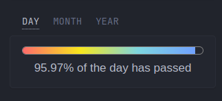

### A bar that shows percentage of day/month/year  elapsed


```yaml
        - type: group
          widgets:
            - type: custom-api
              title: Day
              body-type: string
              skip-json-validation: true
              cache: 1s
              template: |
                {{ $secondsPerDay := 86400 }}
                {{ $localTime := offsetNow "-7h" }}  <!-- America/Vancouver timezone -->

                {{ $elapsedSeconds := add (mul $localTime.Hour 3600) (mul $localTime.Minute 60) | add $localTime.Second }}
                {{ $dayProgress := div (mul $elapsedSeconds 100.0) $secondsPerDay }}

                {{ $gradient := "" }}
                {{ if lt $dayProgress 10.0 }}
                  {{ $gradient = "#70a1ff" }}
                {{ else if lt $dayProgress 25.0 }}
                  {{ $gradient = "#ff6b6b, #70a1ff" }}
                {{ else if lt $dayProgress 50.0 }}
                  {{ $gradient = "#ff6b6b, #f8e71c, #7ed6df" }}
                {{ else }}
                  {{ $gradient = "#ff6b6b, #f8e71c, #7ed6df, #70a1ff" }}
                {{ end }}

                <div style="font-family: sans-serif; text-align: center;">
                  <div style="width: 100%; height: 12px; background: #23262F; border:1px solid gray; border-radius: 10px; overflow: hidden;">
                    <div style="
                      height: 100%;
                      width: {{ $dayProgress }}%;
                      background: linear-gradient(90deg, {{ $gradient }});
                    "></div>
                  </div>
                  <div class="size-h1" style="margin-top: 6px;">{{ printf "%.2f" $dayProgress }}% of the day has passed</div>
                </div>

            - type: custom-api
              title: Month
              body-type: string
              skip-json-validation: true
              cache: 1h
              template: |
                {{ $localTime := offsetNow "-7h" }}  <!-- America/Vancouver timezone -->

                {{ $month := $localTime.Month }}
                {{ $dayOfMonth := $localTime.Day }}

                {{ $secondsToday := add (mul $localTime.Hour 3600) (mul $localTime.Minute 60) | add $localTime.Second }}
                {{ $fractionOfDay := div $secondsToday 86400.0 }}

                {{ $daysInMonth := 31 }}
                {{ if eq $month 2 }} {{ $daysInMonth = 28 }} {{ end }}
                {{ if or (eq $month 4) (eq $month 6) (eq $month 9) (eq $month 11) }} {{ $daysInMonth = 30 }} {{ end }}

                {{ $daysElapsed := add (sub $dayOfMonth 1) $fractionOfDay }}
                {{ $monthProgress := mul (div $daysElapsed $daysInMonth) 100.0 }}

                {{ $gradient := "" }}
                {{ if lt $monthProgress 10.0 }}
                  {{ $gradient = "#70a1ff" }}
                {{ else if lt $monthProgress 25.0 }}
                  {{ $gradient = "#ff6b6b, #70a1ff" }}
                {{ else if lt $monthProgress 50.0 }}
                  {{ $gradient = "#ff6b6b, #f8e71c, #7ed6df" }}
                {{ else }}
                  {{ $gradient = "#ff6b6b, #f8e71c, #7ed6df, #70a1ff" }}
                {{ end }}

                <div style="font-family: sans-serif; text-align: center;">
                  <div style="width: 100%; height: 12px; background: #23262F; border:1px solid gray; border-radius: 10px; overflow: hidden;">
                    <div style="
                      height: 100%;
                      width: {{ $monthProgress }}%;
                      background: linear-gradient(90deg, {{ $gradient }});
                    "></div>
                  </div>
                  <div class="size-h1" style="margin-top: 6px;">{{ printf "%.2f" $monthProgress }}% of the month has passed</div>
                </div>

            - type: custom-api
              title: Year
              body-type: string
              skip-json-validation: true
              cache: 1d
              template: |
                {{ $localTime := offsetNow "-7h" }}  <!-- America/Vancouver timezone -->

                {{ $secondsToday := add (mul $localTime.Hour 3600) (mul $localTime.Minute 60) | add $localTime.Second }}
                {{ $dayOfYear := $localTime.YearDay }}
                {{ $secondsElapsed := add (mul (sub $dayOfYear 1) 86400) $secondsToday }}

                {{ $totalSecondsInYear := mul 365 86400 }}
                {{ $yearProgress := div (mul $secondsElapsed 100.0) $totalSecondsInYear }}

                {{ $gradient := "" }}
                {{ if lt $yearProgress 10.0 }}
                  {{ $gradient = "#70a1ff" }}
                {{ else if lt $yearProgress 25.0 }}
                  {{ $gradient = "#ff6b6b, #70a1ff" }}
                {{ else if lt $yearProgress 50.0 }}
                  {{ $gradient = "#ff6b6b, #f8e71c, #7ed6df" }}
                {{ else }}
                  {{ $gradient = "#ff6b6b, #f8e71c, #7ed6df, #70a1ff" }}
                {{ end }}

                <div style="font-family: sans-serif; text-align: center;">
                  <div style="width: 100%; height: 12px; background: #23262F; border:1px solid gray; border-radius: 10px; overflow: hidden;">
                    <div style="
                      height: 100%;
                      width: {{ $yearProgress }}%;
                      background: linear-gradient(90deg, {{ $gradient }});
                    "></div>
                  </div>
                  <div class="size-h1" style="margin-top: 6px;">{{ printf "%.2f" $yearProgress }}% of the year has passed</div>
                </div>

```

## Note
- All logic for time calculation happens on device. 
- This on-device version **does not support leap years** as at the time of writing, Glance does not support the mod or % operator. If leap year support is needed, please host an external service. Example code below:  

```
export default {
  async fetch(request) {
    const url = new URL(request.url);
    const path = url.pathname;

    const now = new Date().toLocaleString("en-US", {
      timeZone: "America/Vancouver"
    });
    const dt = new Date(now);

    let progress = 0;
    let gradient = "";

    function chooseGradient(pct) {
      if (pct < 10) return "#70a1ff"; // solid red
      if (pct < 25) return "#ff6b6b, #70a1ff"; // red-blue
      if (pct < 50) return "#ff6b6b, #f8e71c, #7ed6df";
      return "#ff6b6b, #f8e71c, #7ed6df, #70a1ff";
    }

    if (path === "/day") {
      const start = new Date(dt);
      start.setHours(0, 0, 0, 0);
      const end = new Date(dt);
      end.setHours(23, 59, 59, 999);
      progress = ((dt - start) / (end - start)) * 100;
      gradient = chooseGradient(progress);
    }

    else if (path === "/month") {
      const start = new Date(dt.getFullYear(), dt.getMonth(), 1);
      const end = new Date(dt.getFullYear(), dt.getMonth() + 1, 0, 23, 59, 59, 999);
      progress = ((dt - start) / (end - start)) * 100;
      gradient = chooseGradient(progress);
    }

    else if (path === "/year") {
      const start = new Date(dt.getFullYear(), 0, 1);
      const end = new Date(dt.getFullYear(), 11, 31, 23, 59, 59, 999);
      progress = ((dt - start) / (end - start)) * 100;
      gradient = chooseGradient(progress);
    }

    else {
      return new Response("Not found", { status: 404 });
    }

    return Response.json({
      progress: parseFloat(progress.toFixed(2)),
      gradient: gradient
    });
  },
};
```